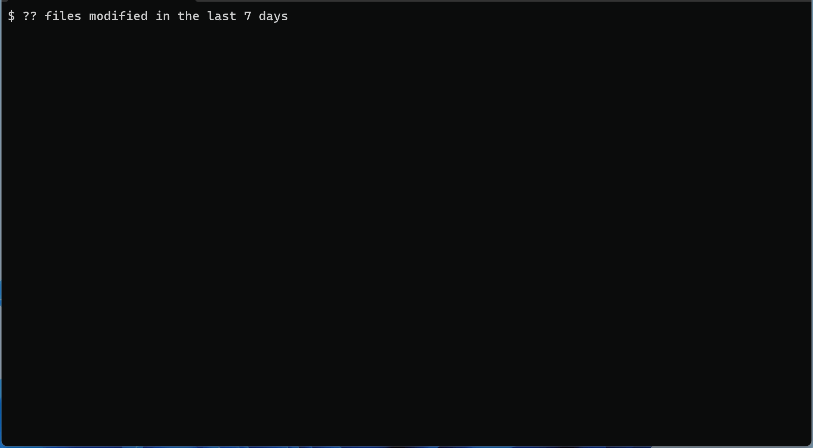
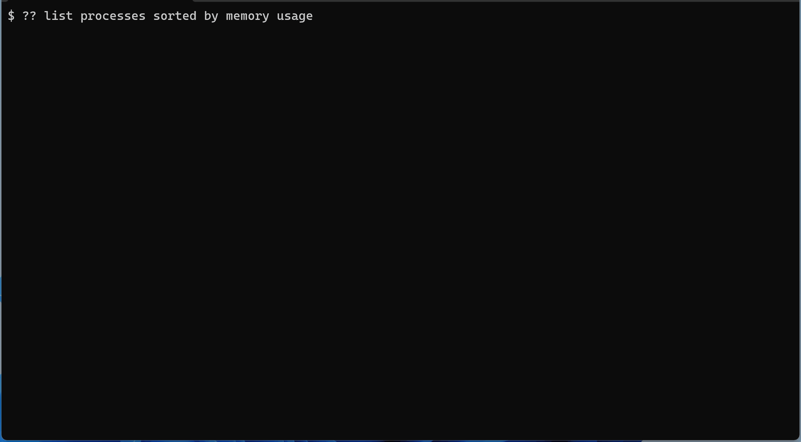

<p align="center">
  
</p>

<p align="center">
  
  
  
  
  
</p>

Shell Whiz will help you generate shell commands from your natural language queries. It is powered by OpenAI's `gpt-3.5-turbo` and is free to use.

## All features
- **Pay as you go:** you only pay for what you use; no subscription is required. Just receive an API key from https://platform.openai.com/account/api-keys.
- **Easy to install:** run `pip install shell-whiz` and you're good to go.
- **Easy to use:** Shell Whiz is a command-line tool.
    - Run `sw ask` to generate shell commands from your natural language queries.
    - Run `sw explain` to get an explanation of any shell command.

## Supported platforms
Shell Whiz is designed to work on various platforms and shells, but it is best suited for Bash on Linux. However, it may sometimes suggest commands that are not compatible with your specific platform or terminal.

## Installation and setup
To install Shell Whiz, run the following command:
```
$ pip install shell-whiz
```

This adds the command `sw` to your PATH.

To use Shell Whiz, you need an API key from OpenAI. You can get this key by visiting https://platform.openai.com/account/api-keys.

Then, run `sw config` to set up your API key.

<details closed><summary>A note about the free API plan for new users</summary>
New users receive $5 for free to try and test the API during the first 3 months. However, it is recommended to upgrade to a paid plan in order to have a more comfortable experience using Shell Whiz. This is because the free plan has restrictions on the number of requests allowed per minute.
</details>

## Upgrading
To upgrade GitHub Copilot CLI, run the following command:
```
$ pip install --upgrade shell-whiz
```

## Usage



You can ran Shell Whiz directly using `sw`, but I recommend creating an alias for it. For example, you can add the following line to your `.bashrc` file:
```
alias ??='sw ask'
```

To track API usage and costs, you can check the [OpenAI API Usage](https://platform.openai.com/account/usage) page.

## License
Shell Whiz is licensed under the GNU General Public License v3.0. See [LICENSE](LICENSE) for more information.
